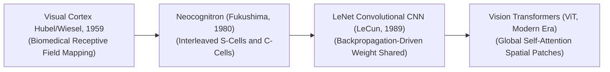
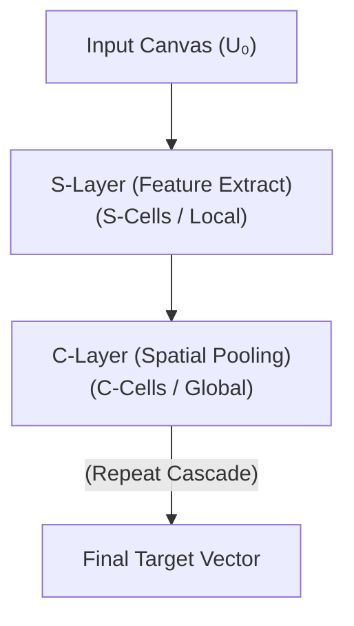

  

# 🧠 Awesome-Neocognitron

  
  

## 📚 The Neocognitron in AI: History, Progression, Architecture, & Legacy

The **Neocognitron** is a foundational, biologically inspired hierarchical neural network architecture designed for robust, translation-invariant visual pattern recognition and image classification. Conceptualized by Kunihiko Fukushima in 1979 and formalized in 1980 ("Neocognitron: A Self-organizing Neural Network Model for a Mechanism of Pattern Recognition Unaffected by Shift in Position"), it directly resolved the extreme fragility of early flat neural models. 

Prior to the Neocognitron, networks like Frank Rosenblatt’s Perceptron or Fukushima's own early Cognitron (1975) collapsed when a target object was shifted by even a single pixel layer, as they lacked geometric or spatial awareness. By replicating the architectural mechanics of the human visual cortex—specifically the interleaved coordination of **Simple Cells** and **Complex Cells** discovered by Hubel and Wiesel—the Neocognitron introduced the structural concepts of localized receptive fields, shared weight parameters, and progressive spatial downsampling. This permanently redefined the trajectory of computer vision, serving as the direct mathematical and structural blueprint for modern **Convolutional Neural Networks (CNNs)**.

---

## 🕰️ 1. The Macro Chronological Evolution

The structural methodology of hierarchical visual feature extraction has transitioned from hand-crafted mammalian models to unsupervised self-organizing networks, backpropagation-driven grids, and modern multi-modal vision transformers.

| Era | Description | Year First Used | Paper Link | Detailed Info |
| --- | --- | --- | --- | --- |
| **The Biomedical Cortical Discovery Era (Hubel & Wiesel, ~1959–1962)** | *Concept:* The core biological baseline. Neurophysiologists David Hubel and Torsten Wiesel mapped the primary visual cortex of a cat. They discovered that the mammalian brain decodes shapes using a clear hierarchy of cells: *Simple Cells* and *Complex Cells*. | 1959 | [Hubel & Wiesel, 1962](#references) | [Read More](biomedical-cortical-discovery.md) |
| **The Architectural Synthesis Era (The Neocognitron, Fukushima, 1980)** | *Concept:* Translated Hubel and Wiesel's biological discovery directly into a computational model. Fukushima constructed a multi-layered neural hierarchy.   *Limitation:* Fragile, hand-tuned learning mechanics. | 1980 | [Fukushima, 1980](#references) | [Read More](architectural-synthesis.md) |
| **The End-to-End Backpropagation Era (LeNet / Classical CNNs, 1989–2012)** | *Concept:* Modernized Fukushima's topology by replacing competitive learning loops with automated mathematical calculus.   *Significance:* Fully automated feature discovery. | 1989 | [LeCun, Y., et al., 1989](#references) | [Read More](end-to-end-backpropagation.md) |
| **The Patchified Global Self-Attention Era (~2020–Present)** | *Concept:* The current modern state-of-the-art vision foundation standard. Architectures like **Vision Transformers (ViTs)** slice images into discrete 2D structural token patches. | 2020 | [Dosovitskiy, A., et al., 2020](#references) | [Read More](patchified-global-self-attention.md) |

---

## 🧱 2. Core Structural Layers & Mathematical Components

The Neocognitron architecture is organized into an alternating cascade of specialized mathematical layers designed to systematically isolate and compress visual data.

| Component | Description | Year First Used | Paper Link | Detailed Info |
| --- | --- | --- | --- | --- |
| **A. S-Cells (Simple Layers / Local Feature Extraction)** | *Mechanism:* Functions as a localized template matching filter.   *Modern Equivalent:* The sliding window kernel function of a standard **Convolutional Layer**. | 1980 | [Fukushima, 1980](#references) | [Read More](s-cells-simple-layers.md) |
| **B. C-Cells (Complex Layers / Spatial Pooling)** | *Mechanism:* Responsible for creating translation invariance.   *Modern Equivalent:* The spatial reduction operations of a **Max-Pooling or Average-Pooling Layer**. | 1980 | [Fukushima, 1980](#references) | [Read More](c-cells-complex-layers.md) |
| **C. Variable vs. Fixed Synaptic Weights** | *Excitatory Synapses:* Trainable parameters.   *Inhibitory Synapses:* Fixed, automated parameters for lateral inhibition. | 1980 | [Fukushima, 1980](#references) | [Read More](variable-vs-fixed-synaptic-weights.md) |

---

## 🎓 3. Learning Paradigms: Unsupervised vs. Supervised

Fukushima engineered two distinct instructional pipelines to train the internal excitatory weight matrices of the Neocognitron.

| Paradigm | Description | Year First Used | Paper Link | Detailed Info |
| --- | --- | --- | --- | --- |
| **Self-Organization via Competitive Learning (Unsupervised Track)** | *Profile:* A data-driven, biological clustering loop. The single neuron that outputs the peak response is crowned the "winner," updating its parameter weights exclusively. | 1975 | [Fukushima, 1975](#references) | [Read More](self-organization-competitive-learning.md) |
| **Coarse-to-Fine Teacher-Guided Training (Supervised Track)** | *Profile:* Human-in-the-loop parameter scaling. A human designer manually designates exactly *where* and *which* local geometric features each S-plane should extract. | 1980 | [Fukushima, 1980](#references) | [Read More](coarse-to-fine-teacher-guided.md) |

---

## 🚧 4. Architectural Bottlenecks & Computer Vision Limitations

While the Neocognitron established the conceptual blueprints for deep vision architectures, physical hardware and mathematical constraints cap its standalone deployment scaling laws.

| Limitation | Description | Year First Used | Paper Link | Detailed Info |
| --- | --- | --- | --- | --- |
| **The Hardware Compute Wall & Lack of Backpropagation** | *The Problem:* Lacks a unified, global optimization loss function.   *Mitigation:* Modern machine learning infrastructures fully replace this with **Stochastic Gradient Descent and Auto-Differentiable backpropagation graphs**. | 1989 | [LeCun, Y., et al., 1989](#references) | [Read More](hardware-compute-wall.md) |
| **The Memory Footprint Inflation Wall** | *The Problem:* Every S-plane requires its own dedicated, uncompressed array of connection parameters.   *Mitigation:* Implementing **Weight Sharing / Parameter Fusing**. | 1989 | [LeCun, Y., et al., 1989](#references) | [Read More](memory-footprint-inflation.md) |

---

## 🏭 5. Industrial Legacy & Modern Descendants

| Legacy | Description | Year First Used | Paper Link | Detailed Info |
| --- | --- | --- | --- | --- |
| **The Foundational Blueprint for Convolutional CNNs (LeNet / ResNet)** | *Application:* Deep Convolutional Neural Networks (CNNs) inherit Fukushima's exact spatial hierarchical layout for tasks like facial recognition. | 1989 | [LeCun, Y., et al., 1989](#references) | [Read More](foundational-blueprint-cnns.md) |
| **Neuromorphic Hardware & Event-Based Spiking Neural Networks (SNNs)** | *Application:* Powers ultra-low-power edge computing chips. Compiles routing logic directly onto silicon microchips. | 2014 | N/A | [Read More](neuromorphic-hardware.md) |
| **Optical Character Recognition (OCR) Billing & Document Ingestion** | *Application:* Automates high-volume financial bank check parsing and enterprise document classification using translation-invariant feature extraction. | 1989 | [LeCun, Y., et al., 1989](#references) | [Read More](optical-character-recognition.md) |

---

## 📖 References
1. Hubel, D. H., & Wiesel, T. N. (1962). Receptive fields, binocular interaction and functional architecture in the cat's visual cortex. *The Journal of Physiology*, 160(1), 106-154.
2. Fukushima, K. (1975). Cognitron: A self-organizing multilayered neural network. *Biological Cybernetics*, 20(3-4), 121-136.
3. Fukushima, K. (1980). Neocognitron: A self-organizing multilayered neural network model for a mechanism of pattern recognition unaffected by shift in position. *Biological Cybernetics*, 36(4), 193-202.
4. LeCun, Y., et al. (1989). Backpropagation applied to handwritten zip code recognition. *Neural Computation*, 1(4), 541-551.
5. Krizhevsky, A., Sutskever, I., & Hinton, G. E. (2012). ImageNet classification with deep convolutional neural networks. *Advances in Neural Information Processing Systems (NeurIPS)*, 25.
6. Dosovitskiy, A., et al. (2020). An image is worth 16x16 words: Transformers for image recognition at scale via patchified self-attention networks. *arXiv preprint arXiv:2010.11929*.

---

To advance this historical documentation repository, vision baseline setup, or computer vision deployment pipeline, consider exploring these adjacent development pathways:
* Build a **Python script using PyTorch** illustrating how to construct a basic 3-layer Convolutional CNN block containing explicit convolutional transformations, ReLU activations, and Max-Pooling operations to replicate the hierarchical S-cell/C-cell progression of the Neocognitron from scratch.
* Generate a **comprehensive Markdown table** explicitly comparing the original 1975 Cognitron, the 1980 Neocognitron, a Classical Convolutional CNN (LeNet), and a modern Vision Transformer (ViT) across mathematical learning algorithms, structural layer composition steps, native resistance to translational spatial shifts, and deployment hardware targets.
* Establish a **performance verification suite using local microcontrollers** to profile exactly how compiling a localized hierarchical filter pass directly inside edge neuromorphic silicon gates alters the wall-clock execution latency and power consumption boundaries of a dynamic visual tracking system.

***

**Follow-Up Navigation Matrix:**

Before updating this historical repository architecture layout, let me know how you would like to proceed by choosing one of the options below:
* I can provide a **complete Python code boilerplate using PyTorch** demonstrating how to write an automated script that applies localized lateral inhibition constraints over a visual feature tensor.
* I can generate a **Markdown matrix table** tracking the explicit receptive field sizes, layer capacities, and spatial pooling dimensions utilized by leading historical vision architectures.
* I can write a detailed technical explanation focusing on the **mathematics of Fukushima's unsupervised competitive reinforcement equations** and how lateral inhibition thresholds govern neuron selection dynamics.
2 sitesFukushima Cognitron | PPTThe many layers and sections of the Cognitron allowed it to be modified so that it could respond in the same way (having the same ...SlideshareRevolutionizing Image Recognition with Vision Transformers (ViT) | by Nanda Siddhardha | Medium23 May 2024 — Vision Transformers address these limitations by treating images as sequences of patches, similar to sequences of words in text, a...Medium

