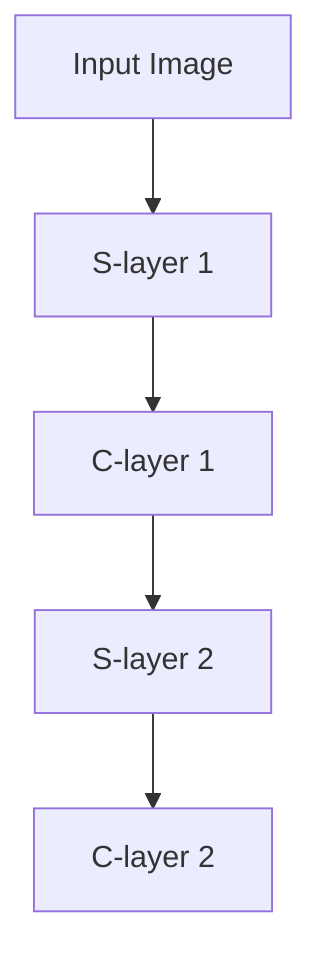

# The Architectural Synthesis Era (The Neocognitron, Fukushima, 1980)

Fukushima translated Hubel and Wiesel's biological discovery directly into a computational model.

```mermaid
flowchart TD
    A[Input Image] --> B[S-layer 1]
    B --> C[C-layer 1]
    C --> D[S-layer 2]
    D --> E[C-layer 2]
```
