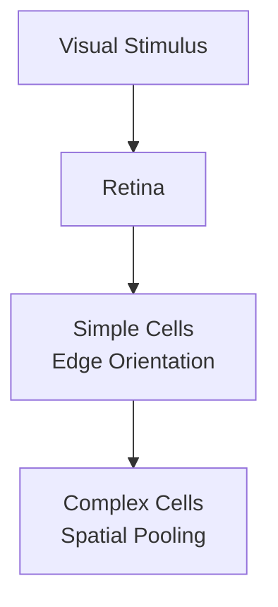

# The Biomedical Cortical Discovery Era (Hubel & Wiesel, ~1959–1962)

Neurophysiologists David Hubel and Torsten Wiesel mapped the primary visual cortex of a cat. They discovered that the mammalian brain decodes shapes using a clear hierarchy of cells.

