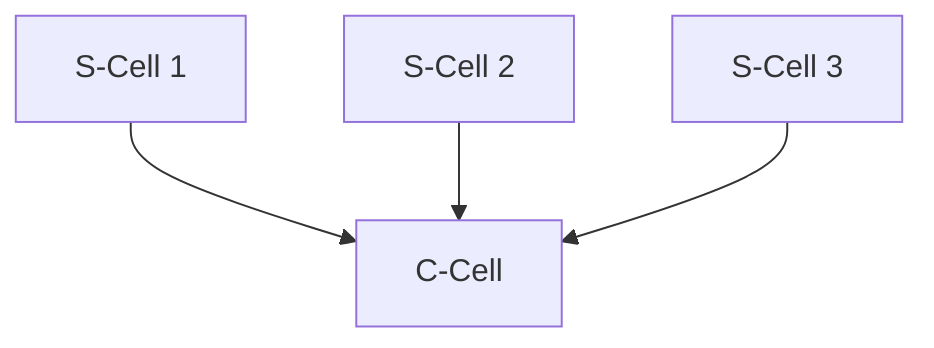

# B. C-Cells (Complex Layers / Spatial Pooling)

Responsible for creating translation invariance. Each individual C-cell connects to a small cluster of S-cells.

```mermaid
flowchart TD
    A[S-Cell 1] --> D[C-Cell]
    B[S-Cell 2] --> D
    C[S-Cell 3] --> D
```
