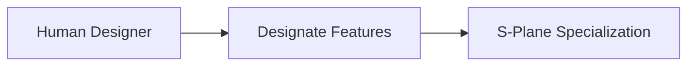

# Coarse-to-Fine Teacher-Guided Training (Supervised Track)

Human-in-the-loop parameter scaling to accelerate training on multi-class datasets.

```mermaid
flowchart LR
    A[Human Designer] --> B[Designate Features]
    B --> C[S-Plane Specialization]
```
