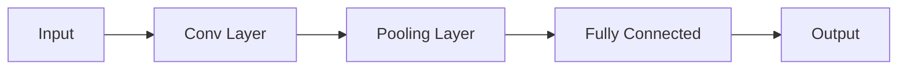

# The End-to-End Backpropagation Era (LeNet / Classical CNNs, 1989–2012)

Modernized Fukushima's topology by replacing competitive learning loops with automated mathematical calculus using Backpropagation and Stochastic Gradient Descent.

