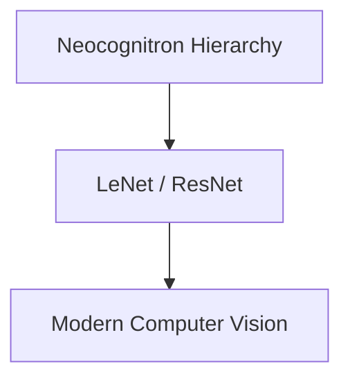

# The Foundational Blueprint for Convolutional CNNs (LeNet / ResNet)

Deep Convolutional Neural Networks (CNNs) inherit Fukushima's exact spatial hierarchical layout.

```mermaid
flowchart TD
    A[Neocognitron Hierarchy] --> B[LeNet / ResNet]
    B --> C[Modern Computer Vision]
```
