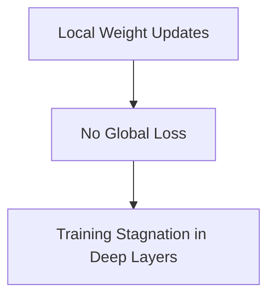

# The Hardware Compute Wall & Lack of Backpropagation

The competitive winner-take-all algorithm updates weights locally, lacking a unified optimization loss function.

```mermaid
flowchart TD
    A[Local Weight Updates] --> B[No Global Loss]
    B --> C[Training Stagnation in Deep Layers]
```
