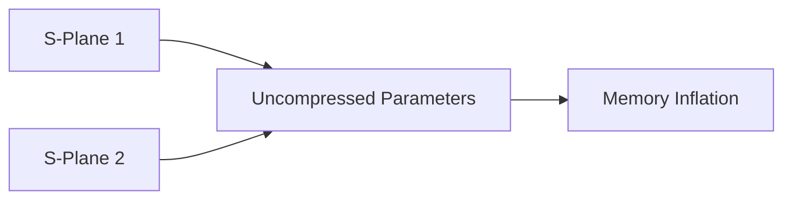

# The Memory Footprint Inflation Wall

Every single S-plane requires its own dedicated, uncompressed array of connection parameters across the canvas, inflating hardware requirements.

```mermaid
flowchart LR
    A[S-Plane 1] --> B[Uncompressed Parameters]
    A2[S-Plane 2] --> B
    B --> C[Memory Inflation]
```
