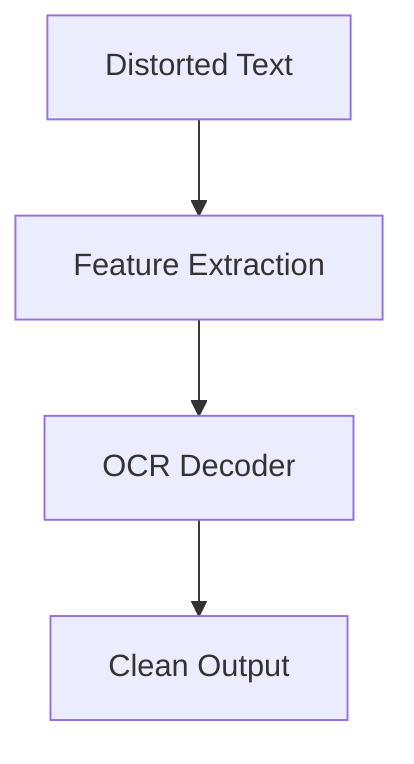

# Optical Character Recognition (OCR) Billing & Document Ingestion

Automates high-volume financial bank check parsing and document classification due to translation-invariant features.

```mermaid
flowchart TD
    A[Distorted Text] --> B[Feature Extraction]
    B --> C[OCR Decoder]
    C --> D[Clean Output]
```
