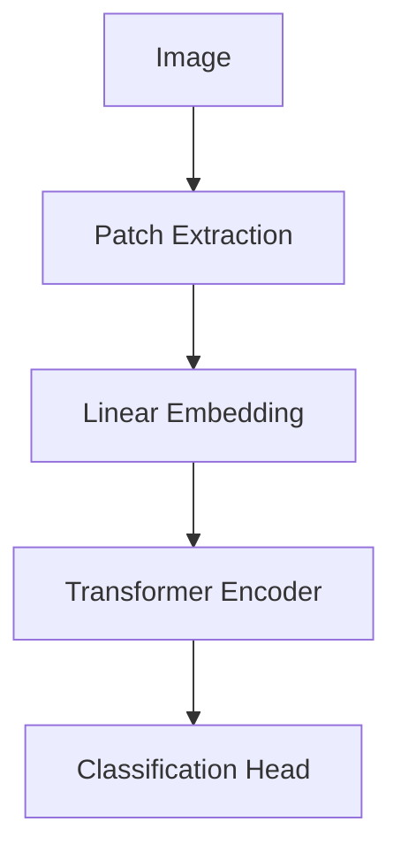

# The Patchified Global Self-Attention Era (~2020–Present)

The current modern state-of-the-art vision foundation standard. Architectures like Vision Transformers (ViTs) slice images into discrete patches.

