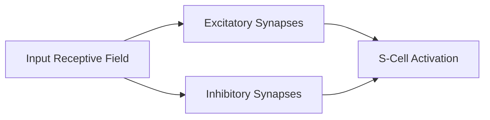

# A. S-Cells (Simple Layers / Local Feature Extraction)

Functions as a localized template matching filter. Ingests a small spatial region (receptive field) from the preceding layer.

```mermaid
flowchart LR
    A[Input Receptive Field] --> B[Excitatory Synapses]
    A --> C[Inhibitory Synapses]
    B --> D[S-Cell Activation]
    C --> D
```
