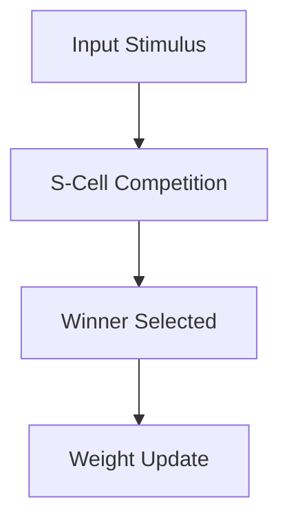

# Self-Organization via Competitive Learning (Unsupervised Track)

A data-driven, biological clustering loop where S-cells compete, and the winner updates its parameters.

```mermaid
flowchart TD
    A[Input Stimulus] --> B[S-Cell Competition]
    B --> C[Winner Selected]
    C --> D[Weight Update]
```
