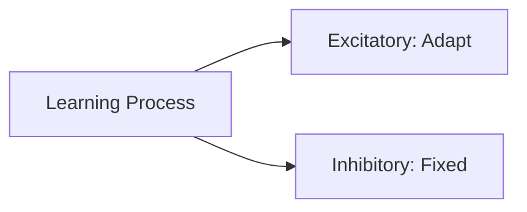

# C. Variable vs. Fixed Synaptic Weights

Excitatory Synapses are trainable parameters, whereas Inhibitory Synapses are fixed, automated parameters.

```mermaid
flowchart LR
    A[Learning Process] --> B[Excitatory: Adapt]
    A --> C[Inhibitory: Fixed]
```
